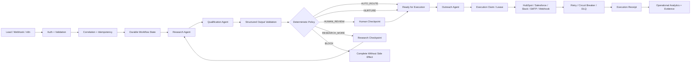
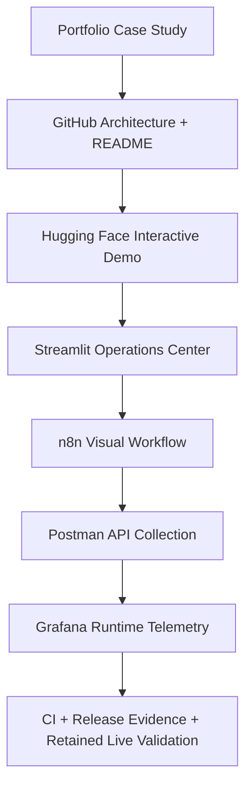

<div align="center">

# Autonomous Revenue Ops

**Production-grade AI agents, governed revenue automation, SaaS integrations, release evidence, and operational proof**

[](https://github.com/h00w/autonomous-revenue-ops/actions/workflows/ci.yml)
[](https://python.org)
[](https://fastapi.tiangolo.com)
[](Dockerfile)
[](deploy/k8s)
[](n8n)
[](https://huggingface.co/spaces/h0000w/autonomous-revenue-ops)
[](docs/phase-10-completion.md)
[](LICENSE)

[**Live Space**](https://huggingface.co/spaces/h0000w/autonomous-revenue-ops) ·
[**Evaluation Dataset**](https://huggingface.co/datasets/h0000w/autonomous-revenue-ops) ·
[**System Card**](https://huggingface.co/h0000w/autonomous-revenue-ops) ·
[**Portfolio Case Study**](https://hendarmawan.se/projects/autonomous-revenue-ops/) ·
[**Public Proof**](docs/public-proof.md)

</div>

<p align="center">
  <a href="https://hendarmawan.se/projects/autonomous-revenue-ops/">
    
  </a>
</p>

---

## The problem

Revenue automation demos are easy to build and hard to trust.

A typical prototype receives a lead, asks an LLM to classify it, writes to a CRM, sends a message, and calls the workflow “autonomous.” That proves a happy path can run once. It does **not** prove that the system can safely handle duplicates, malformed inputs, low-confidence model output, human-review cases, provider failures, stale state, retries, credentials, deployment regressions, or release changes.

**Autonomous Revenue Ops** is an engineering reference implementation for the harder version of the problem:

> How do you let AI contribute useful judgment to revenue operations while keeping authorization, state, side effects, recovery, and evidence under deterministic software control?

The core rule is deliberately simple:

**AI may propose. Software validates. Policy authorizes. Durable state gates execution. Bounded adapters act. Evidence determines completion.**

---

## What it does

The system accepts an inbound lead or signed SaaS event, validates and normalizes it, creates a durable workflow run, performs bounded research and qualification, applies deterministic policy, routes uncertain cases to explicit checkpoints, and only then permits external execution.



### Decision boundary

| Signal | System action |
| --- | --- |
| High score + high confidence + no risk flags | `AUTO_ROUTE` |
| Medium score or risk requiring judgment | `HUMAN_REVIEW` |
| Confidence below threshold | `RESEARCH_MORE` |
| Low-priority but permitted lead | `NURTURE` |
| Missing consent / explicit blocking condition | `BLOCK` |

The LLM never gets direct authority to send, mutate CRM state, or bypass policy.

---

## Why this is more than a chatbot or workflow demo

The repository is organized around failure containment and evidence, not around a single prompt.

| Engineering property | Implementation |
| --- | --- |
| Typed API/domain contracts | FastAPI + Pydantic |
| Multi-provider AI | OpenAI, Anthropic, Gemini adapters |
| Bounded agents | Research, Qualification, Outreach, Supervisor |
| Deterministic authorization | `src/policy.py` |
| Durable orchestration | explicit workflow state machine |
| Restart safety | SQLite-backed workflow/idempotency state |
| Human checkpoints | approval + additional-research states |
| Side-effect control | execution claims, leases, bounded adapters |
| Reliability | retries, circuit breaker, DLQ, replay |
| API security | API key boundary, HMAC signed webhooks, replay protection |
| SaaS integrations | HubSpot, Salesforce, Slack, SMTP, HTTPS webhook |
| Evaluation | frozen regression cases + agent release gate |
| Prompt governance | prompt manifest/version/hash control |
| Operational analytics | aggregate measured-runtime telemetry |
| Deployment hardening | non-root/read-only container + Kubernetes contract |
| Release integrity | pinned runtime, SPDX SBOM, provenance metadata, SHA-256 verification |
| Live-validation framework | exact source/release-bound retained evidence |

---

## Public proof surfaces

One demo surface cannot prove architecture, orchestration, API behavior, evaluation, and operations equally well. The project therefore uses a **proof stack**.

| Surface | What it proves | Status |
| --- | --- | --- |
| [GitHub](https://github.com/h00w/autonomous-revenue-ops) | source, tests, ADRs, CI, deployment/release controls | **Live** |
| [Hugging Face Space](https://huggingface.co/spaces/h0000w/autonomous-revenue-ops) | interactive system/policy behavior | **Live** |
| [Hugging Face Dataset](https://huggingface.co/datasets/h0000w/autonomous-revenue-ops) | evaluation/regression data | **Live** |
| [Hugging Face system card](https://huggingface.co/h0000w/autonomous-revenue-ops) | intended use, limitations, evidence boundary | **Live** |
| [Hugging Face Bucket](https://huggingface.co/buckets/h0000w/autonomous-revenue-ops) | auxiliary public artifacts | **Live** |
| [Portfolio case study](https://hendarmawan.se/projects/autonomous-revenue-ops/) | recruiter/client narrative and architecture | **Publication layer** |
| Streamlit Operations Center | measured-runtime reviewer dashboard | **Source ready · deployment next** |
| n8n visual orchestration | importable trigger/orchestration flow | **Workflow ready** |
| Render staging API | public FastAPI/OpenAPI sandbox | **Deployment next** |
| Grafana Cloud | operational telemetry dashboard | **Dashboard JSON ready** |
| Postman Public Workspace | forkable API examples | **Collection ready** |
| GitHub Releases + GHCR | versioned runtime/release artifacts | **Workflow ready · tag publication pending** |

See [Public Demo & Distribution Stack](docs/public-demo-stack.md) for the rollout sequence.

### Reviewer proof path



The goal is that a recruiter, engineering leader, or client can understand the business problem in under 30 seconds and reach inspectable engineering evidence in under two minutes.

---

## Current evidence

The Phase 11 publication head preserves every production/release gate and adds contract checks for the public proof surfaces:

| Evidence | Result |
| --- | ---: |
| Python regression suite | **119/119 passed** |
| Deterministic policy benchmark | **6/6 (100%)** |
| Structured-output success | **100%** |
| Deterministic decision accuracy | **100%** |
| Outreach / authorization agreement | **100%** |
| Routing / trace integrity | **100%** |
| Prompt boundary integrity | **100%** |
| Policy violations | **0** |
| Agent evaluation cases | **7** |
| Default OpenAI / Anthropic / Gemini external calls | **0** |
| Default HubSpot / Salesforce / Slack / SMTP calls | **0** |
| Public surface contract tests | **3/3 passed** |
| Release version contract | **PASS / v0.10.0** |
| Release-integrity verification | **PASS** |
| Hardened container liveness | **HTTP 200 / ok** |
| Hardened container readiness | **HTTP 200 / ok** |

The 100% agent values above are **deterministic contract/governance evidence using controlled fixtures**. They are not presented as live-provider model accuracy.

### Maturity boundary

The repository is a **release-integrity-controlled, deployment-candidate, contract-tested, security-hardened single-replica architecture proof with retained live-validation machinery**.

It is **not yet Production Validated**. Real provider/SaaS/staging executions still need to be run through the manual retained-evidence workflow and reviewed. Long-window SLO evidence and shared transactional persistence are also required before broader production/scaling claims.

---

## Release and validation flow

```mermaid
flowchart LR
    A[Code / Prompt / Policy / Workflow Change] --> B[Regression Tests]
    B --> C[Policy Benchmark]
    C --> D[Deterministic Agent Gate]
    D --> E[Zero-call Provider / SaaS / SLO Harnesses]
    E --> F[Deployment Contract]
    F --> G[Release Version Contract]
    G --> H[Manifest + SPDX SBOM + Provenance]
    H --> I[Retained-Evidence Contract]
    I --> J[Hardened Container Boot]
    J --> K{Exact Head Green?}
    K -->|No| A
    K -->|Yes| L[Merge]
    L --> M[Explicit Manual Sandbox Validation]
    M --> N[Source-bound Evidence Bundle]
```



A live evidence bundle cannot be emitted without a matching release manifest for the exact source commit and service version.

---

## Operations Center

The reviewer dashboard lives in [`dashboards/streamlit/`](dashboards/streamlit/).

It reads only aggregate operational evidence from:

- `GET /health/live`
- `GET /health/ready`
- `GET /v1/analytics/summary`

When no live staging API is attached, it explicitly displays **no runtime telemetry** rather than generating fake production data.

Deploy it to Streamlit Community Cloud using:

```text
dashboards/streamlit/streamlit_app.py
```

Configure the host with secret-managed:

```text
ARO_API_BASE_URL=https://<staging-api>
ARO_API_KEY=<staging-only-api-key>
```

---

## n8n orchestration

The importable workflow is [`n8n/lead-intake.workflow.json`](n8n/lead-intake.workflow.json).

```text
Webhook
  ↓
Correlation + Idempotency
  ↓
POST /v1/workflows/leads
  ↓
Governed API workflow
  ↓
Durable state + policy + execution evidence
```

Use n8n as the **visual trigger/integration layer**, not as the policy authority. For authenticated staging, attach an n8n Header Auth credential with `X-ARO-API-Key`; do not commit credentials into the exported workflow.

See [`n8n/README.md`](n8n/README.md).

---

## API and observability assets

### Postman

Import:

```text
postman/autonomous-revenue-ops.postman_collection.json
```

The collection includes health, governed workflow, runtime analytics, and Prometheus endpoints. It is secret-free and intended for a future Postman Public Workspace.

### Grafana

Import:

```text
observability/grafana/autonomous-revenue-ops-overview.json
```

The dashboard uses only aggregate `aro_*` metrics such as workflow counts, completion/failure ratios, policy decisions, human-review ratio, recovery, execution receipts, and lifecycle duration.

---

## Architecture boundaries that matter

### AI is not the authorization layer

Research and qualification agents may produce evidence, scores, risk flags, and outreach drafts. Deterministic software decides whether any side effect is allowed.

### Workflow state lives outside the agent

Checkpoint state, idempotency, revisions, leases, recovery, and execution receipts are durable software state, not conversational memory.

### Failure is a first-class path

The system has explicit handling for retries, stale writers, duplicates, rate limits, downstream errors, auth failures, circuit breaking, DLQ and replay.

### Operational evidence is separated from business projection

`measured_runtime` telemetry is calculated from persisted workflows. `scenario_projection` is intentionally hypothetical and is never labeled customer ROI.

### SQLite means one application replica

The current durable store is SQLite, so the Kubernetes reference intentionally remains:

- `replicas: 1`
- `Recreate` strategy
- `ReadWriteOnce` storage
- fail-closed readiness if SQLite is configured with multiple replicas

Horizontal replicas require a shared transactional backend plus concurrency/failover validation.

---

## Run locally

```bash
git clone https://github.com/h00w/autonomous-revenue-ops.git
cd autonomous-revenue-ops
python -m venv .venv
python -m pip install -r requirements.txt
cp .env.example .env
uvicorn src.api:app --reload --host 0.0.0.0 --port 8000
```

Run the deterministic non-network verification chain:

```bash
make verify
```

Build the hardened runtime:

```bash
docker build -t autonomous-revenue-ops:0.10.0 .
```

Run the Operations Center locally:

```bash
python -m pip install -r dashboards/streamlit/requirements.txt
streamlit run dashboards/streamlit/streamlit_app.py
```

---

## Key API endpoints

| Endpoint | Purpose |
| --- | --- |
| `GET /health/live` | process liveness |
| `GET /health/ready` | deployment readiness |
| `POST /v1/leads/evaluate` | governed direct evaluation |
| `POST /v1/workflows/leads` | create/replay durable lead workflow |
| `GET /v1/workflows/runs/{run_id}` | inspect workflow state |
| `POST /v1/workflows/runs/{run_id}/approval` | human approval/rejection |
| `POST /v1/workflows/runs/{run_id}/resume-research` | resume research checkpoint |
| `POST /v1/workflows/runs/{run_id}/claim` | claim authorized execution |
| `POST /v1/workflows/runs/{run_id}/complete` | record execution receipt |
| `POST /v1/workflows/recover` | recover persisted stalled runs |
| `POST /v1/webhooks/lead` | signed/replay-protected ingress |
| `GET /v1/analytics/summary` | aggregate measured runtime |
| `GET /v1/analytics/metrics` | Prometheus-compatible metrics |
| `POST /v1/analytics/impact` | explicitly labeled scenario projection |

---

## Retained live validation

Real external checks are **manual only**.

```bash
export ARO_SOURCE_COMMIT="$(git rev-parse HEAD)"
python scripts/release_evidence.py --output release-evidence
python scripts/verify_release_evidence.py release-evidence

python scripts/ai_provider_smoke.py openai \
  --execute \
  --evidence-dir live-validation-evidence/openai-smoke

python scripts/verify_live_evidence.py live-validation-evidence/openai-smoke
```

Repository-managed execution is available through:

**Actions → Retained Live Validation → Run workflow**

The workflow is `main`-only, requires explicit sandbox/test/staging acknowledgement, performs release-binding and credential preflight, verifies the result, and uploads the evidence as a retained artifact.

---

## Project status

| Phase | Status |
| --- | --- |
| 0 — Foundation & publication | ✅ Complete |
| 1 — Core production architecture | ✅ Complete |
| 2 — SaaS & CRM integrations | ✅ Contract-complete · 🔬 live validation pending |
| 3 — Multi-model AI & agents | ✅ Contract-complete · 🔬 live validation pending |
| 4 — Workflow orchestration | ✅ Complete |
| 5 — Reliability, recovery & security | ✅ Complete |
| 6 — Evaluation & release gates | ✅ Deterministic gate complete · 🔬 live model eval pending |
| 7 — Operational analytics | ✅ Complete |
| 8 — Deployment hardening & SLO evidence | ✅ Complete |
| 9 — Release integrity & public proof | ✅ Complete |
| 10 — Retained live validation evidence | ✅ Framework complete · 🔬 external execution pending |
| 11 — Public demo & distribution surfaces | ✅ Source complete · 🌐 external deployments pending |

---

## Documentation

### Architecture and operation

- [System design](docs/system-design.md)
- [Agent architecture](docs/agent-architecture.md)
- [Workflow orchestration](docs/workflow-orchestration.md)
- [Integration architecture](docs/integrations.md)
- [Reliability architecture](docs/reliability-architecture.md)
- [Security controls](docs/security.md)
- [Operational analytics](docs/operational-analytics.md)
- [Deployment architecture](docs/deployment-architecture.md)
- [SLO evidence model](docs/slo-evidence.md)
- [Retained live validation](docs/live-validation-evidence.md)
- [Public demo stack](docs/public-demo-stack.md)
- [90-second public proof](docs/public-proof.md)

### Phase records

- [Phase 1](docs/phase-1-completion.md)
- [Phase 2](docs/phase-2-completion.md)
- [Phase 3](docs/phase-3-completion.md)
- [Phase 4](docs/phase-4-completion.md)
- [Phase 5](docs/phase-5-completion.md)
- [Phase 6](docs/phase-6-completion.md)
- [Phase 7](docs/phase-7-completion.md)
- [Phase 8](docs/phase-8-completion.md)
- [Phase 9](docs/phase-9-completion.md)
- [Phase 10](docs/phase-10-completion.md)

---

## What still needs to happen

The Hugging Face publication layer is already strong. The highest-value additions now are:

1. **Deploy the Streamlit Operations Center** and connect it to a staging API.
2. **Deploy the FastAPI Docker image to a staging host** so OpenAPI, health and workflow endpoints are publicly inspectable.
3. **Publish the n8n orchestration demo** as a safe visual proof using sandbox credentials.
4. **Publish the Postman collection** to a public workspace.
5. **Attach Grafana Cloud** to the aggregate Prometheus surface and publish a safe shared dashboard.
6. **Execute retained live validations** for at least one model provider, one CRM/integration and the staging deployment.
7. **Publish `v0.10.0` through the guarded release workflow** so GHCR/GitHub Release become retained release evidence.
8. **Migrate durable workflow state to PostgreSQL** before making horizontal-replica production claims.

These additions create the full public chain:

```text
GitHub source
→ Hugging Face interactive proof
→ Streamlit operations console
→ n8n orchestration
→ Postman API proof
→ Grafana telemetry
→ staging deployment
→ retained live evidence
→ versioned release artifact
→ portfolio case study + technical article
```

---

## Reference design lineage

The presentation borrows a useful portfolio pattern: state the business problem clearly, make the workflow visually readable, expose deployable artifacts, document setup, and explain the engineering decisions. This implementation extends that pattern with deterministic authorization, durable state, security boundaries, release engineering, evaluation gates, operational telemetry, and retained evidence rather than treating an AI workflow as production-ready by default.

---

## Author

**Hendarmawan, PhD Eng.**  
Production AI · Agentic Systems · AI Automation · Secure AI Infrastructure

[Website](https://hendarmawan.se) · [GitHub](https://github.com/h00w) · [Agentic AI Academy](https://hendarmawan.se/agentic-ai/)
