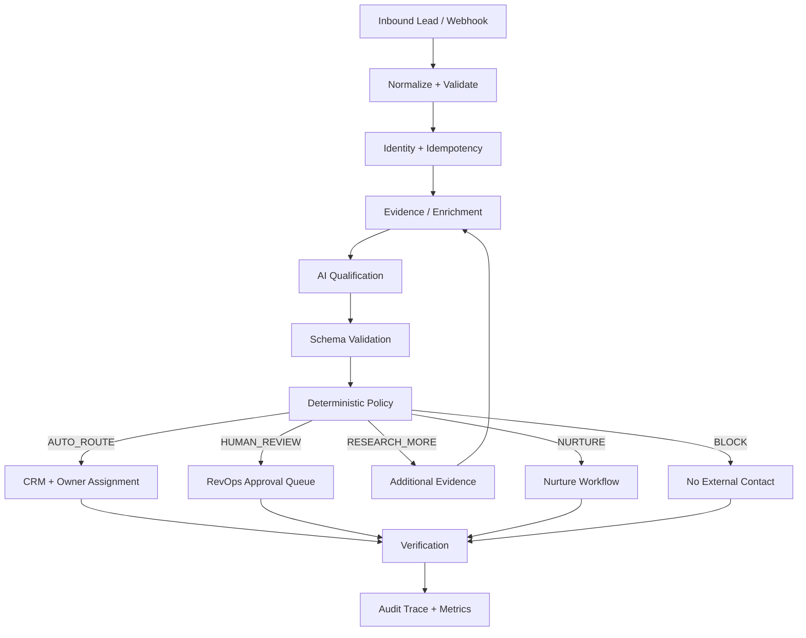

# Architecture

## Design objective

Autonomous Revenue Ops is a production-oriented reference implementation for AI-assisted revenue operations. It separates probabilistic reasoning from deterministic authorization and external side effects.

## Control flow



## Architectural rules

1. **Validate before model calls.** Malformed or incomplete input never reaches an LLM or external API.
2. **Structured AI output only.** Qualification is represented by typed fields, not free-form routing text.
3. **AI proposes; policy authorizes.** Model output is never equivalent to permission to execute.
4. **Side effects are bounded.** CRM, email, calendar, messaging, and enrichment integrations belong behind adapters with explicit scopes.
5. **Every consequential transition is auditable.** Production implementations should persist event ID, correlation ID, policy version, provider/model metadata, result, latency, retries, and errors.
6. **Failure is a workflow state.** Rate limits, timeouts, provider failures, duplicate events, and invalid model output must route to retry/review/DLQ behavior rather than disappear.
7. **Maturity claims require evidence.** A working demo is not automatically production-validated.

## Integration boundaries

Recommended adapters:

```text
CRMProvider
  ├─ HubSpotCRM
  ├─ SalesforceCRM
  └─ MockCRM

LLMProvider
  ├─ OpenAIProvider
  ├─ AnthropicProvider
  └─ GeminiProvider

NotificationProvider
  ├─ Slack
  ├─ Email
  └─ SMS
```

The current public proof keeps external side effects simulated so reviewers can evaluate the governance logic without credentials.

## Production readiness gates

A deployment should not be called production-validated until evidence exists for:

- authentication and authorization
- webhook signature validation
- idempotency and duplicate suppression
- retry/backoff and rate-limit handling
- dead-letter persistence and replay
- model/prompt regression evaluation
- centralized observability
- secrets management
- privacy/retention controls
- cost and latency budgets
- incident/runbook testing
- measured business outcomes
