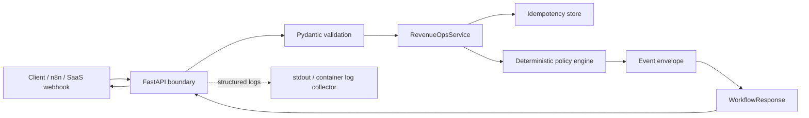

# System Design — Phase 1 Core Production Architecture

## Purpose

Phase 1 turns the Phase 0 policy proof into a service that has explicit runtime boundaries. The production API is intentionally separate from the Gradio reviewer surface so the UI can evolve independently from the core workflow engine.

## Runtime architecture

## Separation of concerns

| Layer | Responsibility | Current implementation |
| --- | --- | --- |
| API | HTTP contracts, headers, health endpoints | `src/api.py` |
| Configuration | environment-specific runtime settings | `src/config.py` |
| Validation | reject malformed lead/qualification state | Pydantic models in `src/models.py` |
| Service | coordinate idempotency, policy, event creation | `src/service.py` |
| Policy | authorize or block business actions | `src/policy.py` |
| Idempotency | prevent duplicate workflow execution | `src/idempotency.py` |
| Observability | structured access/workflow logs | `src/logging_config.py` |
| Reviewer UI | interactive portfolio proof | root `app.py` |

## Request lifecycle

1. Client sends `POST /v1/leads/evaluate`.
2. Middleware accepts or generates `X-Correlation-ID`.
3. FastAPI/Pydantic validates the request before workflow logic runs.
4. The service uses an explicit `Idempotency-Key` or derives a stable key from the canonical request payload.
5. A cached result is returned for duplicate requests during the configured TTL.
6. New requests are evaluated by the deterministic policy engine.
7. A versioned event envelope records event ID, correlation ID, idempotency key, source and decision metadata.
8. The response is returned and logged as structured JSON.

## Health model

- `/health/live`: process is running and can answer HTTP requests.
- `/health/ready`: application dependencies required by the current phase report ready.

In later phases readiness will include durable storage, CRM/provider connectivity and queue health. Liveness must remain shallow so an external dependency outage does not create a restart loop.

## Dependency direction

The service depends on interfaces/primitives below the API boundary. Business policy never imports FastAPI. This prevents transport concerns from becoming embedded in decision logic and lets future n8n, CLI, batch, queue or worker entry points reuse the same service.

## Phase 1 limitations by design

- idempotency storage is process-local and not durable;
- there are no live CRM or messaging side effects;
- authentication and webhook signature verification are deferred to later security/integration phases;
- no distributed queue or dead-letter store exists yet;
- readiness checks only cover Phase 1 dependencies.

These are explicit maturity boundaries, not hidden production claims.
